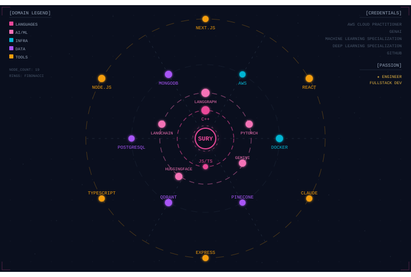

  
   

  

  
  
  
  

 

<!-- Plain-text about — always visible even without SVG rendering -->

  <strong>Suryansh</strong> · SURY 
  <strong>AI Engineer</strong> · <strong>Full Stack Developer</strong> · <strong>Exploring DevOps</strong> · <strong>Student</strong> 
  LangGraph · MCP · vector memory · NextJs 
  BTech · Rajiv Gandhi Institute of Petroleum Technology · 2024-2028 Batch 

 

  

  

 

  

  

 

  

  

 

  

  
   
  
   
  
   
  
   
  
   
  
    
  

 

  

### // The Build Philosophy

The tools I can't stop thinking about share one property: they make you feel something before they explain themselves. The interface communicates intent. The system has a point of view. The experience is inseparable from the function.

Most software solves the problem and calls it done. I want the version that also makes you go *oh, this was built by someone who cares about me as a user.*

That means different things depending on what I'm shipping:

| If it's a **fullstack product** | The frontend is the contract. React, Next.js, TypeScript — typed, predictable, fast. The backend should never make the UI apologize for it. Express, Node.js, clean REST or GraphQL boundaries. |
| :--- | :--- |
| If it's a **Gen AI system** | It shouldn't just answer; it should *orchestrate*. Memory, tool use, state graphs. LangGraph turns the agent architecture into the product itself. Vector search isn't a feature — it's the nervous system. |
| If it's an **interface** | The terminal is enough canvas. Dense information, monospace type, a palette that doesn't apologize. If it looks like a cockpit, it probably works like one. |
| If it's **infrastructure** | It should be invisible in the right way. Docker containers that spin up without drama. CI/CD that just ships. AWS, GCP, Kubernetes — tools that stay out of the way until you need them. |

The constraint I keep coming back to: **a beautiful thing that doesn't solve the problem is art. A solution that's ugly is a missed opportunity.** I want both, every time.

---

### ∞ The Eternal Curiosity Problem

I have a condition. It starts with one question: *why does this deployment take 40 seconds?* Three hours later I'm deep in multi-stage Docker builds, BuildKit cache mounts, and wondering if I should just rewrite the whole pipeline in GitHub Actions with matrix strategies. (I do.)

Some rabbit holes I've genuinely gone down: why Next.js SSR hydration fails the way it does · whether agent memory architectures should mirror human sleep consolidation · what makes a CI/CD pipeline *actually* fast versus just feeling fast · the geometry of high-dimensional vector spaces and why cosine similarity is weirder than it looks · why Kubernetes defaults are almost never what you want in production.

> *"The test of a first-rate intelligence is the ability to hold two opposed ideas in mind at the same time and still retain the ability to function."* — F. Scott Fitzgerald, unknowingly describing debugging a CORS error at 2am while your container is crashing in prod.

 

  

### System Telemetry

  <table border="0" cellpadding="0" cellspacing="0">
    <tr>
      <td align="center">
        
      </td>
      <td align="center">
        
      </td>
    </tr>
    <tr>
      <td colspan="2" align="center">
         
        
      </td>
    </tr>
  </table>

 

  <picture>
    <source media="(prefers-color-scheme: dark)" srcset="https://raw.githubusercontent.com/suryanshbst/suryanshbst/output/snake.svg?palette=github-dark">
    <source media="(prefers-color-scheme: light)" srcset="https://raw.githubusercontent.com/suryanshbst/suryanshbst/output/snake.svg">
    
  </picture>

 

 

